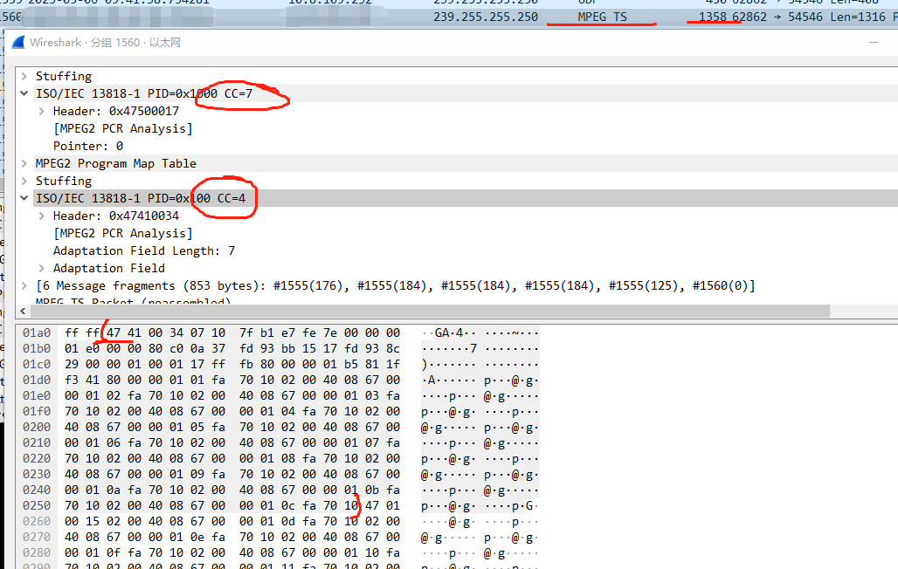

#  视频拼接

 
ffmepg 支持非常丰富的推流命令，简单介绍一下使用 ffmpeg 和 ffplay 在局域网使用 udp协议推拉流。

```
ffmpeg -buffer_size 1024000 -i udp://@224.1.1.3:20000  -i udp://@224.1.1.3:20000 -filter_complex "[0:v]crop=1900:1060:10:10,scale=1920:1080[v0];[1:v]crop=1900:1060:10:10,scale=1920:1080[v1];[v0][v1]hstack=2[out]" -map [out]  -pkt_size 1316 -c:v h264_nvenc -gpu 1 -f mpegts  udp://@239.255.255.250:54543
```


OSDffmpeg -t 5 -i recodeFile.mp4 -vf "drawtext=fontfile=STSONG.TTF:fontcolor=red:fontsize=100:x=0:y=0:text='%{localtime\:%Y-%M-%d %H.%m.%S}'" -c:v libx264 -an -f mp4 output.mp4 -y
还可以增加属性
fontfile=STSONG.TTF字体类型，可以从 C:\Windows\Fonts 拷贝一个有效的字体文件放到当前目录。
fontcolor=red颜色
fontsize=100大小
x=0:y=0坐标
text='%{localtime\:%Y-%M-%d %H.%m.%S}'具体的值
 
 -buffer_size 1024000 -i udp://@224.1.1.3:20000  -i udp://@224.1.1.3:20000 -i udp://@224.1.1.3:20000  -filter_complex "[0:v]crop=1900:1060:10:10,scale=1920:1080[v0];[1:v]crop=1900:1060:10:10,scale=1920:1080[v1][2:v]crop=1900:1060:10:10,scale=1920:1080[v2];[v0][v1][v2]hstack=3

drawtext=fontfile=simkai.ttf:fontcolor=red:fontsize=100:x=0:y=0:text='大家好啊 ！！！'

```
ffmpeg -buffer_size 1024000 -i udp://@224.1.1.3:20000  -i udp://@224.1.1.3:20000 -i udp://@224.1.1.3:20000 -filter_complex "[0:v]crop=1900:1060:10:10,scale=1920:1080[v0];[1:v]crop=1900:1060:10:10,scale=1920:1080[v1];[2:v]crop=1900:1060:10:10,scale=1920:1080[v2];[v0][v1][2]hstack=3,drawtext=fontfile=simkai.ttf:fontcolor=red:fontsize=100:x=0:y=0:text='大家好啊 ！！！'[out]" -map [out]  -pkt_size 1316 -c:v h264_nvenc -gpu 1 -f mpegts  udp://@239.255.255.250:54543

```

UDP 单播推拉流

# udp 单播推流

```
ffmpeg.exe -re -stream_loop -1 -i .\JFLA.mp4 -vcodec copy -pkt_size 1300 -f h264 "udp://192.168.22.83:10189"
```

# udp 单播拉流

```
ffplay.exe -f h264 "udp://192.168.22.83:10189" -fflags nobuffer -nofind_stream_info
```
 
UDP 组播推拉流

udp组播地址

组播地址范围 224.0.0.0 – 239.255.255.255

224.0.0.0–224.0.0.255 本地保留，给知名协议使用，ttl=1。其中224.0.0.1是本网所有主机接收，224.0.0.2是本网所有路由器接收。

# udp 组播推流

// 169.254.119.31

```
ffmpeg.exe -re -stream_loop -1 -i .\input.mp4 -vcodec copy -pkt_size 1300 -f h264 "udp://239.0.0.1:54546?buffer_size=0&localaddr=192.168.22.119" 


# cmd
ffmpeg.exe -re -stream_loop -1 -i .\input.mp4 -vcodec copy -pkt_size 1300 -f h264 "udp://239.0.0.1:54546?buffer_size=0&localaddr=169.254.119.31" 
```

# udp 组播拉流

```
ffplay.exe -f h264 "udp://239.0.0.1:54546" -fflags nobuffer -nofind_stream_info
```
 
UDP 广播推拉流

# udp 广播推流

```
ffmpeg.exe -re -stream_loop -1 -i .\JFLA.mp4 -vcodec copy -pkt_size 1300 -f h264 "udp://192.168.22.255:10189"
```

# udp拉流

```
ffplay.exe -f h264 "udp://192.168.22.119:10189" -fflags nobuffer -nofind_stream_info
```


```
ffmpeg.exe -re -stream_loop -1 -i C:\test_01.mp4 -vcodec copy -pkt_size 1400 -f h264 "udp://239.255.255.250:54546"
```

推一个MP4到本机的组播地址（netsh interface ipv4 show joins  查看win本机的组播地址）

 

从这个组播地址拉流，注意不是组播分发出去再拉回来，相当于这里是拉“推给组播地址的原始流”：

```
ffplay.exe -f h264 "udp://239.255.255.250:54546" -fflags nobuffer -nofind_stream_info
```

因为组播地址不具备存储功能，所以拉流要等到有I帧才显示；




 

UDP TS 组播推流

```
ffmpeg.exe -re -stream_loop -1 -i C:\U_01.mp4 -f mpegts  "udp://239.255.255.250:54546"
```

注意这里发出去的TS包并不是严格的188字节，而是188字节的整数倍；可能一次发送好几个TS包也是正常的
 
 
```
 ffplay.exe -i "udp://239.255.255.250:54546" -fflags nobuffer -nofind_stream_info
```


# Linux上编译


ffmpeg-6.1版本

```
./configure     --enable-version3  --enable-cuda --enable-cuvid --enable-nvdec --enable-nvenc   --enable-avfilter  --enable-libx264          --enable-static   --enable-gpl   --enable-cross-compile  --extra-cflags="-I/home/pc/Work/nv-codec-headers"  --extra-ldflags="-L/usr/lib64"  

```


## 1、 查看当前编译ffmpeg支持avfilter模块

```
./ffmpeg --list-filters
```


## 2、测试ffmpeg功能命令


```

```